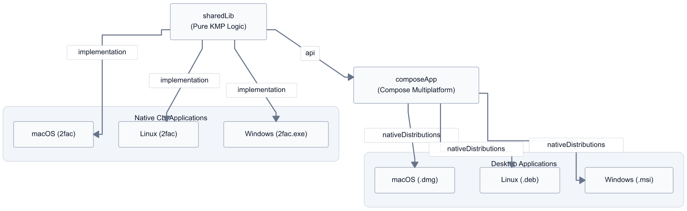
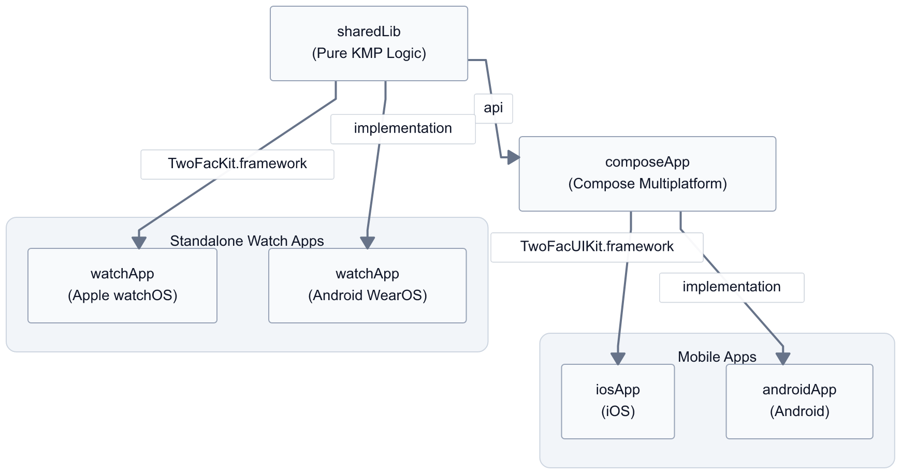
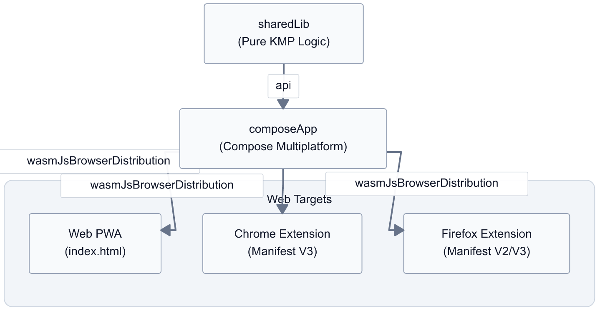

# Architecting TwoFac: My Journey into Kotlin Multiplatform Module Structure

In my [previous post](https://arnav.tech/my-next-project-building-the-open-source-cross-platform-authenticator-i-always-wanted), I talked about why I'm building **TwoFac**. The short version? I got tired of proprietary "digital cages" like Authy and wanted an authenticator that was open, secure, and—most importantly—everywhere I am.

When I started sketching out the project, I knew I wanted it to run on everything from my Android phone and Apple Watch to my Linux terminal and Chrome browser. But as usually happens during such "yak shaving sessions," I spent a good chunk of time just thinking about the architecture. How do you share code between a SwiftUI Watch app, a Wasm-based browser extension, and a native Linux CLI without losing your mind?

Today, I want to walk you through the technical decisions and the module structure that makes TwoFac possible.

## The Core Philosophy: Logic as a Library


A mistake I see often in cross-platform development is trying to force a single UI framework onto every device. While Compose Multiplatform is amazing (and we use it!), sometimes you just want a native experience—like on the tiny circular screen of a watch.

I decided that the "brain" of TwoFac—the part that handles TOTP/HOTP generation, `otpauth://` parsing, and encryption—should be a pure, logic-only library. It shouldn't know or care about buttons, screens, or viewmodels.

This became our `sharedLib` module.

### How the Platforms Connect to the Core

Because `sharedLib` is pure Kotlin Multiplatform, it gets exported in formats native to every ecosystem we target. But how do the actual applications consume it? This is where the module structure gets interesting.

**The** `composeApp` **Bridge:** Most of our visual applications—Android, Desktop, and Web—reside in the `composeApp` module. This module depends directly on `sharedLib` as a standard Kotlin library. It acts as the shared UI layer, using Compose Multiplatform to draw the screens.

*   **Desktop:** The `composeApp` can be compiled into native desktop GUI applications, packaged as standard installers (`.dmg` for macOS, `.msi` for Windows, `.deb` for Linux).
    
*   **Web (WasmJS):** For the web, `composeApp` uses the new `wasmJs` target. This allows us to deploy the app as a downloadable Progressive Web App (PWA) running via an `index.html`. Incredibly, we use the exact same compiled Wasm binary to power the `popup.html` and `sidepanel.html` of our Chrome and Firefox browser extensions!
    

**Thin Wrappers for Mobile:** If `composeApp` holds the UI, how do the mobile apps work? We have very thin `androidApp` and `iosApp` modules that essentially just "boot up" the shared UI.

*   For Android, `androidApp` just contains the `MainActivity` that calls the Compose content. With the recent Android Gradle Plugin (AGP) 9.0 updates, keeping the Android application plugin (`com.android.application`) separate from the Kotlin Multiplatform plugin (`org.jetbrains.kotlin.multiplatform`) is actually mandated, making this thin wrapper pattern not just good architecture, but a requirement.
    
*   Similarly, `iosApp` is just a standard Xcode project with a Swift entry point that delegates to the shared Compose UI framework.
    

**The Pure Native CLI (**`cliApp`**):**


Our CLI tool is completely separate from `composeApp`. It depends directly on `sharedLib`. But here is the cool part: `cliApp` uses Kotlin/Native to compile into a pure native binary for Mac, Windows, and Linux. There is zero JVM involved when you run `2fac` in your terminal; it links against `sharedLib` as a native `klib`, making it incredibly fast.

**Why the Watches Stand Alone:** You might notice we have separate `watchApp` (Android Wear) and iOS watch modules. Why not use `composeApp`? A full-blown Compose Multiplatform UI is heavy, and on a tiny circular screen, the UI needs are fundamentally different. I didn't want the watch apps to inherit the bloat of the main application. Instead, they are designed to be thin clients that simply display synced accounts. Therefore, they bypass `composeApp` entirely and depend directly on `sharedLib` to handle the decryption and TOTP generation locally, using native UI frameworks (like SwiftUI for the Apple Watch) for the best possible performance and look.

### Desktop and CLI Applications

Our desktop and command-line interfaces are tailored for each major operating system. The CLI links directly to the `sharedLib` for instant native execution, while the graphical desktop apps use `composeApp` to render the UI.



### Mobile and Watch Applications

For mobile devices, `composeApp` acts as the shared UI layer wrapped by very thin native application projects. However, the watch apps bypass the shared UI layer entirely, directly consuming `sharedLib` and using platform-native UIs (Compose for WearOS and SwiftUI for Apple Watch).



### Web App and Browser Extensions

Leveraging the power of Wasm, the exact same `composeApp` output is used to generate our Progressive Web App as well as our browser extensions, ensuring complete feature parity across the web ecosystem.



## The "Terminal First" Experience

I use CLI tools extensively (lately, I've been living in tools like Claude Code), and I wanted TwoFac to feel like a native citizen of the terminal.

Since `sharedLib` can compile to native binaries, our `cliApp` is a lightning-fast tool with zero JVM overhead. I'm using [Clikt](https://ajalt.github.io/clikt/) for command parsing and [Mordant](https://github.com/ajalt/mordant) for those pretty terminal colors we all love.

When I run `2fac generate github`, I don't want to wait for a runtime to boot up. I want my code, and I want it now.

## Managing the Chaos with Version Catalogs

If you've followed my blog for a while, you know [I'm a big fan of Gradle Version Catalogs](https://arnav.tech/managing-libraries-and-dependencies-in-android-projects-with-gradle-version-catalog). With 10+ targets and multiple modules, trying to keep versions in sync manually would be a nightmare.

Every single dependency in TwoFac is managed in `gradle/libs.versions.toml`. Whether it's the Kotlin version or a specific crypto provider, it's defined once.

```toml
[versions]
kotlin = "2.3.10"
kstore = "2.0.4"
crypto-kt = "0.5.0"

[libraries]
kstore-core = { module = "tech.arnav:kstore", version.ref = "kstore" }
crypto-core = { module = "dev.whyoleg.cryptography:cryptography-core", version.ref = "crypto-kt" }
```

## Data Persistence: Enter KStore


One problem I faced early on was how to handle data storage. A browser extension uses `localStorage`, a mobile app uses files (or DataStore), and a CLI tool might use a hidden folder in `$HOME`.

I absolutely love [KStore](https://github.com/championswimmer/KStore) for this. It provides a unified, coroutine-based API for storage across all platforms. In TwoFac, we use it to save our `accounts.json`—the encrypted store for all your 2FA secrets—regardless of whether we're on a watch, a phone, or a server.

### Finding the "Right" Directory with AppDirs

But where exactly should `accounts.json` live? On Windows, it should be in `AppData/Roaming`. On macOS, it's `Library/Application Support`. On Linux, it's usually `$HOME/.local/share`.

To handle this, I used the [Kotlin Multiplatform AppDirs](https://github.com/Syer123/kotlin-multiplatform-appdirs) library. It's a KMP rewrite of the classic Java `AppDirs` library that helps you find these platform-specific directories without writing a single line of `expect/actual` code.

### A Fork for the Modern Age

You might notice in our `libs.versions.toml` that we're using my own fork of KStore (`tech.arnav:kstore`).

While the original [xxfast/KStore](https://github.com/xxfast/KStore) is excellent, it hadn't been updated to use the latest **Kotlin Multiplatform Hierarchy Template**. This new internal structure in Kotlin 1.9.20+ makes it much easier to share code between intermediate targets (like `appleMain` or `nativeMain`). I forked it to ensure TwoFac could benefit from the most modern Gradle setups and to add support for the `wasmJs` targets we need for our browser extensions.

## What's Next?

By keeping the core logic decoupled from the UI, we've built an architecture that is both flexible and robust. The same security audits that apply to the CLI tool automatically apply to the Apple Watch app, because they are running the exact same code.

In the next post, I'll dive into the **Cryptography** side of things—how we use `cryptography-kotlin` to keep your secrets safe while making them accessible across all your devices.

* * *

### Links and References

*   [TwoFac GitHub Repository](https://github.com/championswimmer/TwoFac)
    
*   [Compose Multiplatform Documentation](https://www.jetbrains.com/lp/compose-multiplatform/)
    
*   [Kotlin Multiplatform Official Guide](https://kotlinlang.org/docs/multiplatform.html)
