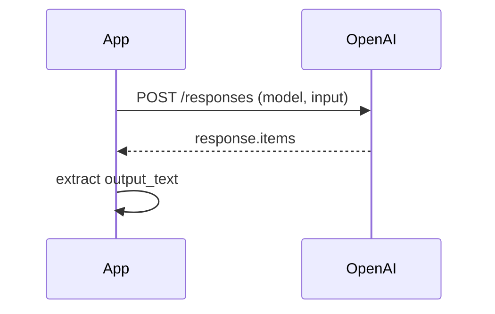
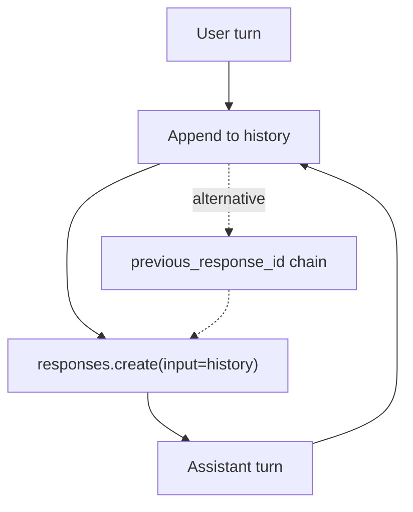
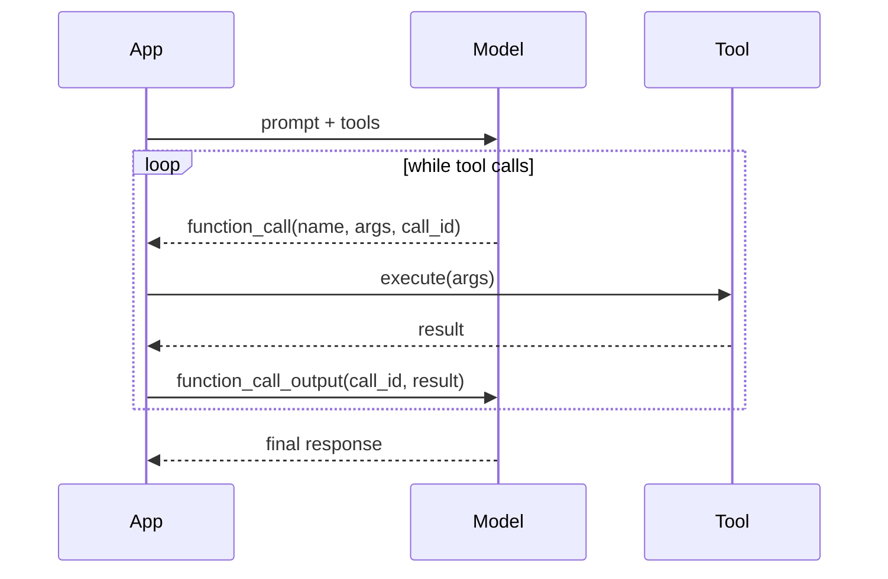
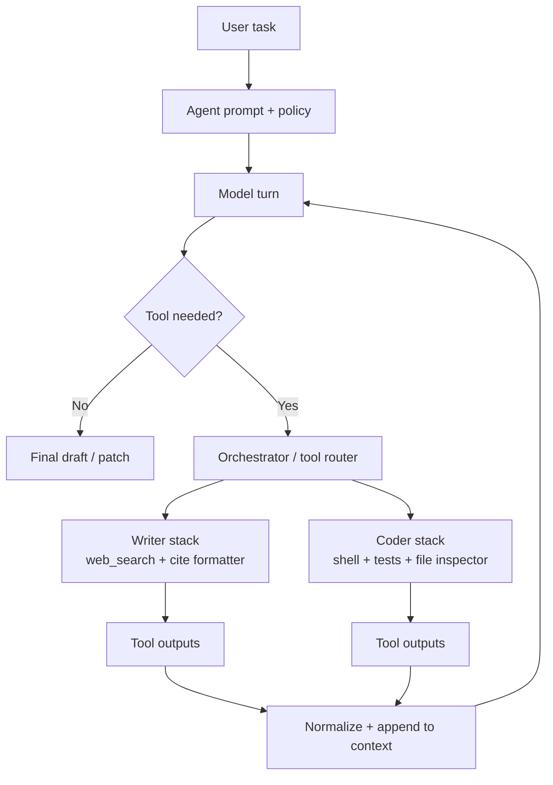
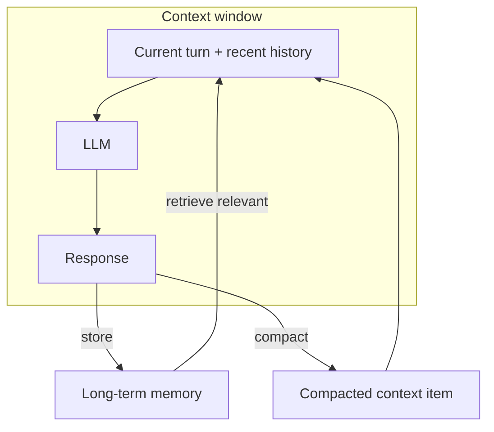
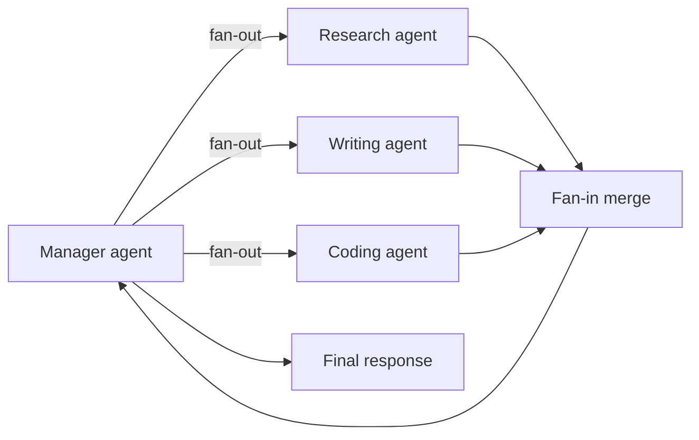
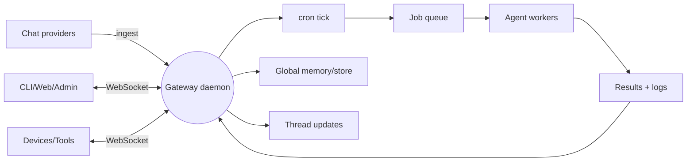

Over the last few months, projects like [**Gas Town**](https://github.com/steveyegge/gastown) by Steve Yegge and [**OpenClaw**](https://docs.openclaw.ai/concepts/architecture) by Peter Steinberger have made “AI agent orchestrators” feel suddenly mainstream. It is tempting to treat them as a new kind of intelligence, but under the hood they are still a small set of primitives wired together with discipline: an LLM API call, a state loop, tools, memory, and orchestration.

This raises a practical question: what is actually inside an “agent,” and how is it different from [**ChatGPT**](https://chatgpt.com/) (a chat UI over a model) or coding tools like [**Claude Code**](https://code.claude.com/docs/en/overview) (an agentic coding surface)? [Gas Town’s README](https://github.com/steveyegge/gastown) frames it as a “multi‑agent orchestration system for Claude Code with persistent work tracking” — i.e., an orchestration layer on top of existing coding agents, not a new model class. Likewise, [Claude Code’s docs](https://code.claude.com/docs/en/overview) describe it as an “agentic coding tool that reads your codebase, edits files, runs commands, and integrates with your development tools” — a powerful agent shell, not the core model itself.

In this article I’ll walk through each layer, show TypeScript code snippets, and then assemble a minimal reference implementation, using public docs as anchors. The goal is to make “agent” a concrete stack you can build and reason about, rather than a black box.

## 1) The bare-metal LLM call

Everything starts with a plain text-in, text-out call. OpenAI’s Responses API is the recommended entry point. The SDK example below is the minimum viable “agent brain” — it just generates text.

```ts
import OpenAI from "openai";

const client = new OpenAI({ apiKey: process.env.OPENAI_API_KEY });

const response = await client.responses.create({
  model: "gpt-5.2",
  input: "Write a one-sentence bedtime story about a unicorn.",
});

console.log(response.output_text);
```



References:
- OpenAI Text generation guide: https://platform.openai.com/docs/guides/text
- OpenAI TypeScript SDK: https://github.com/openai/openai-node

## 2) Turning completion into chat (the for-loop)

Chat is not a separate API concept. It is just a loop that keeps appending history. The API is stateless unless you pass context. This for-loop is the whole trick.

```ts
const history = [
  { role: "developer", content: "You are a concise coding assistant." },
];

for (const userInput of turns) {
  history.push({ role: "user", content: userInput });
  const response = await client.responses.create({
    model: "gpt-5.2",
    input: history,
  });
  history.push({ role: "assistant", content: response.output_text ?? "" });
}
```



At this stage the model is only using its internal knowledge plus what you send. It does not search. It does not execute. It is still a “completion engine”. For example, at this stage if you ask the model about recent events (after its training cutoff date), it will not be able to tell you. The initial release of ChatGPT, before any search capabilities, was just this. 

References:
- OpenAI Conversation state: https://platform.openai.com/docs/guides/conversation-state

## 3) Tool calling: the model asks, your code executes

Tool calling is where agents become agents. The model can request a tool; **your application executes it** and sends the output back. OpenAI’s docs describe the flow explicitly: “Execute code on the application side with input from the tool call,” and “When the model calls a function, you must execute it and return the result.”

```ts
const tools = [
  {
    type: "function",
    name: "get_weather",
    description: "Get the current weather for a location.",
    parameters: {
      type: "object",
      properties: {
        location: { type: "string" },
        units: { type: "string", enum: ["celsius", "fahrenheit"] },
      },
      required: ["location", "units"],
      additionalProperties: false,
    },
  },
];

const input = [{ role: "user", content: "What's the weather in Paris?" }];

const response = await client.responses.create({
  model: "gpt-5.2",
  tools,
  input,
});

for (const item of response.output) {
  if (item.type !== "function_call" || item.name !== "get_weather") continue;
  const result = getWeather(JSON.parse(item.arguments));
  input.push({
    type: "function_call_output",
    call_id: item.call_id,
    output: JSON.stringify(result),
  });
}
```



The Responses API is described as “agentic by default,” because it supports multiple tool calls inside a single request.

References:
- OpenAI Function calling guide: https://platform.openai.com/docs/guides/function-calling
- OpenAI Responses API benefits: https://platform.openai.com/docs/guides/migrate-to-responses

## 4) Writing agents and coding agents

Once tool calling works, specialization is just tool design. A writing agent needs search and citations. A coding agent needs shell access, tests, and documentation. Both are the same loop, different tools.

**Writing agent (search + citations)**

```ts
const tools = [
  {
    type: "function",
    name: "web_search",
    description: "Search the web for sources to cite.",
    parameters: {
      type: "object",
      properties: { query: { type: "string" } },
      required: ["query"],
      additionalProperties: false,
    },
  },
];

const input = [
  { role: "developer", content: "You are a writing agent. Cite sources with inline links." },
  { role: "user", content: "Write two paragraphs about the history of Markdown." },
];
```

Example trace (writing agent, simplified):

```json
[
  {"role":"user","content":"Write two paragraphs about Markdown with citations."},
  {"type":"function_call","name":"web_search","arguments":"{\"query\":\"Markdown history original announcement\"}"},
  {"type":"function_call_output","name":"web_search","output":"[{\"title\":\"Daring Fireball: Markdown\",\"url\":\"https://daringfireball.net/projects/markdown/\",\"snippet\":\"Markdown is a text-to-HTML conversion tool...\"}]"},
  {"role":"assistant","content":"Markdown was introduced by John Gruber as a text-to-HTML conversion tool... ([source](https://daringfireball.net/projects/markdown/))."}
]
```

**Coding agent (shell + tests)**

```ts
const tools = [
  {
    type: "function",
    name: "shell",
    description: "Run a shell command in the repo.",
    parameters: {
      type: "object",
      properties: { command: { type: "string" } },
      required: ["command"],
      additionalProperties: false,
    },
  },
];

const input = [
  { role: "developer", content: "You are a coding agent. Use shell to run tests and inspect files." },
  { role: "user", content: "Tests are failing. Find the failure and suggest a patch." },
];
```

Example trace (coding agent, simplified):

```json
[
  {"role":"user","content":"Tests are failing. Find the failure and suggest a patch."},
  {"type":"function_call","name":"shell","arguments":"{\"command\":\"npm test -- --runInBand\"}"},
  {"type":"function_call_output","name":"shell","output":"{\"exitCode\":1,\"stdout\":\"FAIL src/math.test.ts\",\"stderr\":\"Expected 3, received 4\"}"},
  {"type":"function_call","name":"shell","arguments":"{\"command\":\"sed -n '1,120p' src/math.ts\"}"},
  {"type":"function_call_output","name":"shell","output":"{\"exitCode\":0,\"stdout\":\"export const add = (a,b)=>a+b+1;\"}"},
  {"role":"assistant","content":"Bug in add(): remove the +1. Suggested patch: export const add = (a,b)=>a+b;"}
]
```



References:
- OpenAI tool calling flow: https://platform.openai.com/docs/guides/function-calling
- OpenAI practical guide to building agents: https://openai.com/business/guides-and-resources/a-practical-guide-to-building-ai-agents/

## 5) Context limits, compaction, and memory

Every agent hits the context window. This creates three issues: rising cost, forgotten instructions, and session loss. The fixes are standard:

- **Compaction**: OpenAI provides server-side compaction and a standalone `/responses/compact` endpoint that returns a compacted context window.
- **Memory**: store long-term context in a database (vector store or logs) and retrieve it when needed. Lilian Weng’s survey describes this as short-term memory (context window) vs. long-term memory (external retrieval).
- **Session boundaries**: a new session has no idea about prior runs unless you explicitly pass memory or chain responses.



References:
- OpenAI Compaction guide: https://platform.openai.com/docs/guides/compaction
- OpenAI Conversation state: https://platform.openai.com/docs/guides/conversation-state
- Lilian Weng, LLM Powered Autonomous Agents: https://lilianweng.github.io/posts/2023-06-23-agent/

## 6) Orchestrators and multi-agent fan-out

Orchestrators are what make OpenClaw-style systems feel “real.” One agent delegates to many specialists, then merges the result. OpenAI’s agent guide describes two patterns: a **manager** agent (agents-as-tools) and a **decentralized** handoff model. Both are graph execution with tool calls at the edges.

A key implementation detail: if the model emits multiple tool calls, the orchestration layer decides whether to execute them sequentially or in parallel. OpenAI’s Agents SDK docs explicitly expose this switch (`parallel_tool_calls`) and also describe code-first orchestration with parallel execution primitives (for example, `asyncio.gather`). In a shell-centric harness, the same rule applies: independent tool calls can be dispatched in separate subprocesses (for example, separate `bash`/command workers) and then fan-in their outputs; dependent calls should stay serialized.



Example fan-out trace (simplified JSON):

```json
[
  {"role":"user","content":"Draft a 1-page brief on vector databases with citations and a code sample."},
  {"role":"assistant","content":"I will delegate research, citations, and code sample."},
  {"type":"tool_call","name":"agent_research","arguments":"{\"task\":\"Background + key concepts\"}"},
  {"type":"tool_call","name":"agent_citations","arguments":"{\"task\":\"Find authoritative sources\"}"},
  {"type":"tool_call","name":"agent_code","arguments":"{\"task\":\"Minimal TS example with a vector store API\"}"},
  {"type":"tool_result","name":"agent_research","output":"Key concepts: embeddings, ANN search, HNSW..."},
  {"type":"tool_result","name":"agent_citations","output":"Sources: openai docs, Weng survey, FAISS paper..."},
  {"type":"tool_result","name":"agent_code","output":"Code sample: embed + upsert + query"},
  {"role":"assistant","content":"Merged brief with citations and code sample."}
]
```

References:
- OpenAI practical guide to building agents: https://openai.com/business/guides-and-resources/a-practical-guide-to-building-ai-agents/
- OpenAI Agents guide: https://platform.openai.com/docs/guides/agents
- OpenAI Agents SDK orchestration patterns: https://openai.github.io/openai-agents-python/multi_agent/
- OpenAI Agents SDK model settings (`parallel_tool_calls`): https://openai.github.io/openai-agents-python/ref/model_settings/
- OpenAI cookbook parallel agents example: https://developers.openai.com/cookbook/examples/agents_sdk/parallel_agents
- Node.js child processes (`spawn`/`exec` for separate subprocesses): https://nodejs.org/api/child_process.html

## 7) Skills, MCP, and capability expansion

Tools are the base layer, but two concepts make agent systems feel *modular*: **Skills** and **MCP**. OpenAI defines Skills as “versioned bundles of files” with a `SKILL.md` manifest, designed to codify reusable processes. You can mount them in hosted or local shell environments so the model can invoke them as needed. Skills are powerful precisely because they can package both instructions and code.

Example: mounting a skill in a hosted shell (TypeScript):

```ts
const response = await client.responses.create({
  model: "gpt-5.2",
  tools: [
    {
      type: "shell",
      environment: {
        type: "container_auto",
        skills: [{ type: "skill_reference", skill_id: "skill_basic_math" }],
      },
    },
  ],
  input: "Use the basic-math skill to add 144 and 377.",
});
```

MCP (Model Context Protocol) is the other half of the expansion story. It’s an open standard for connecting models to external systems. OpenAI’s connector/MCP tooling exposes this directly in the Responses API: “You can give models new capabilities using **connectors** and **remote MCP servers**.” These tools can be gated by explicit approval, and the docs emphasize the risk surface: “A malicious server can exfiltrate sensitive data from anything that enters the model’s context.”

Example: MCP tool setup (remote server) with approval gating:

```ts
const response = await client.responses.create({
  model: "gpt-5.2",
  tools: [
    {
      type: "mcp",
      server_label: "github",
      server_url: "https://mcp.github.example/sse",
      require_approval: "always",
      allowed_tools: ["list_prs", "get_commit", "merge_pr"],
    },
  ],
  input: "Summarize open PRs for repo foo/bar.",
});
```

Typical layout (Skills, MCP servers, and integrations):

```
agent-system/                     <--- repo root for the agent harness
  skills/                         <--- reusable skill bundles
    basic-math/ 
      SKILL.md   <--- skill manifest + instructions
      scripts/         
        add.py   <--- executable to do deterministic logic 
  mcp-servers/                    <--- MCP server implementations
    github/                       
      package.json           <--- server deps + metadata
      src/ 
        server.ts         <--- MCP server entrypoint (can be expressjs)
        tools/ 
          list_prs.ts     <--- uses github GraphQL api to return PRs
          get_commit.ts   <--- find commit details
          merge_pr.ts     <--- makes POST request to merge a PR
  integrations/                    <--- local connector implementations
    connectors/  
      dropbox.ts       <--- Dropbox connector (handles auth etc)
      gmail.ts         <--- Gmail connector
```

MCP servers usually expose a list of tools (their input schemas and names). The model sees those tools and can call them like any other tool call; your harness still owns approvals and can restrict which tools are exposed.

Example: a GitHub MCP server in action (hypothetical trace):

```json
[
  {"role":"user","content":"Show me open PRs in foo/bar and merge the top one if checks are green."},
  {"type":"mcp_list_tools","server_label":"github","tools":["list_prs","get_pr","merge_pr"]},
  {"type":"tool_call","name":"list_prs","arguments":"{\"repo\":\"foo/bar\",\"state\":\"open\"}"},
  {"type":"tool_result","name":"list_prs","output":"[{\"number\":42,\"title\":\"Fix build\",\"checks\":\"green\"}]"},
  {"type":"mcp_approval_request","name":"merge_pr","arguments":"{\"repo\":\"foo/bar\",\"number\":42}"},
  {"type":"mcp_approval_response","approve":true},
  {"type":"tool_call","name":"merge_pr","arguments":"{\"repo\":\"foo/bar\",\"number\":42}"},
  {"type":"tool_result","name":"merge_pr","output":"merged"},
  {"role":"assistant","content":"Merged PR #42 after checks passed."}
]
```

Permissions and approvals are the key guardrail. The MCP guide notes: “By default, OpenAI will request your approval before any data is shared with a connector or remote MCP server.” You can relax these approvals once trust is established, but the default is permissioned by design.

References:
- OpenAI Skills guide: https://platform.openai.com/docs/guides/tools-skills
- OpenAI Connectors and MCP servers: https://platform.openai.com/docs/guides/tools-connectors-mcp
- MCP overview: https://modelcontextprotocol.io/docs/getting-started/intro

## 8) Harnessed tools, permissions, and shell-centric agents

Tool calls are **requests**, not execution. The harness (your app) is responsible for enforcing permissions, sandboxing, and actually running commands. The OpenAI shell guide is blunt: “Running arbitrary shell commands can be dangerous. Always sandbox execution, apply allowlists or denylists where possible, and log tool activity for auditing.” It also clarifies how the control loop works: the model emits `shell_call` items, **your runtime executes them**, then you send back `shell_call_output`.

This is why shell‑centric agents are so powerful. Tools like Codex CLI, or lightweight local harnesses, treat the model as a planner and the shell as the executor. Minimal harnesses (think “single file shell agent”) can already support build/test/fix loops. Stack a scheduler, memory, and orchestration on top, and you are now halfway to systems like OpenClaw.

References:
- OpenAI Shell tool: https://platform.openai.com/docs/guides/tools-shell
- OpenAI Local shell tool: https://platform.openai.com/docs/guides/tools-local-shell
- OpenAI Connectors/MCP approvals: https://platform.openai.com/docs/guides/tools-connectors-mcp

## 9) A minimal OpenClaw-style reference implementation

Here’s the smallest possible control plane, expanded with a more OpenClaw‑like shape. OpenClaw’s docs describe a **Gateway**: a single long‑lived daemon that owns messaging surfaces, exposes a WebSocket API, and emits system events like `cron` and `heartbeat`. The Gateway runs on a host continuously, and its periodic cron ticks are the trigger to poll queues, check health, and schedule work. When new tasks arrive from chat or clients, the Gateway creates jobs in a queue, spawns agent runs (often in separate worker processes or runtimes), streams progress back to clients, and finally persists results into memory.

In other words: the “cron tick” is not just a timer, it is the heartbeat of the control plane. It’s where the Gateway decides which jobs to claim, which agents to spawn, and how to advance long‑running work. It also decides when a job is complete (all sub‑agents have returned, or exit criteria met) and sends a final status back to the original chat thread.



```ts
type Job = {
  id: string;
  source: "chat" | "client";
  threadId: string;
  prompt: string;
  status: "queued" | "running" | "done" | "failed";
};

async function onIncomingChat(threadId: string, prompt: string) {
  // Chat/client message becomes a queued job.
  await enqueueJob({
    id: `job_${Date.now()}`,
    source: "chat",
    threadId,
    prompt,
    status: "queued",
  });
}

async function cronTick() {
  // Claim a small batch so multiple workers can share the queue.
  const jobs = await claimQueuedJobs({ limit: 5 });

  for (const job of jobs) {
    // Update status and notify the originating thread.
    await updateJob(job.id, "running");
    await notifyThread(job.threadId, "started", { jobId: job.id });

    // Pull relevant memory before delegating work.
    const memory = await searchMemory(job.prompt);

    // Fan out to specialist agents in parallel.
    const [research, citations] = await Promise.all([
      runAgent("research", `Research background: ${job.prompt}`),
      runAgent("citations", `Find sources for: ${job.prompt}`),
    ]);

    // Fan-in: assemble a final draft with memory + sources.
    const draft = await runAgent(
      "writer",
      `Draft answer for: ${job.prompt}\n\nContext:\n${memory}\n\nSources:\n${citations}`
    );

    // Persist result and close out the job.
    await writeMemory(`Job ${job.id} summary:\n${draft}`);
    await updateJob(job.id, "done");
    await notifyThread(job.threadId, "completed", { jobId: job.id, draft });
  }
}
```

That is the full stack: LLM call, loop, tools, memory, orchestration. Everything else is engineering around reliability, safety, cost, and UX.

References:
- OpenHands repo: https://github.com/OpenHands/OpenHands
- OpenClaw Gateway architecture: https://docs.openclaw.ai/concepts/architecture
- ReAct paper (Reasoning + Acting): https://arxiv.org/abs/2210.03629

## Closing

If you strip away the hype, modern agent frameworks are just well‑engineered loops: deterministic code around probabilistic models. The wins come from tool design, memory strategy, and orchestration discipline, not from “prompt magic.”

If you want to build this out further, a few practical next steps make the biggest difference:

1) **Add guardrails**: tool approvals, allowlists/denylists, and sandboxing. The OpenAI shell tool docs stress that executing arbitrary commands is dangerous and should be sandboxed and logged. https://platform.openai.com/docs/guides/tools-shell
2) **Make tools modular**: Skills and MCP servers let you package capabilities and expose them safely. See OpenAI’s Skills guide and Connectors/MCP docs. https://platform.openai.com/docs/guides/tools-skills https://platform.openai.com/docs/guides/tools-connectors-mcp
3) **Scale orchestration**: if you want many agents, study systems like Gas Town (multi‑agent orchestration with persistent work tracking) and OpenClaw’s Gateway architecture for long‑lived control planes. https://github.com/steveyegge/gastown https://docs.openclaw.ai/concepts/architecture
4) **Harden memory**: learn how compaction, conversation state, and retrieval are handled in production. https://platform.openai.com/docs/guides/compaction https://platform.openai.com/docs/guides/conversation-state
5) **Learn from coding agents**: Claude Code is a concrete example of an “agentic coding tool” that reads codebases, edits files, and runs commands. https://code.claude.com/docs/en/overview

Start tiny: one LLM call, one loop, one tool. Then scale the loop into a harness, and scale the harness into a system.

## Further reading

- OpenAI Agents guide: https://platform.openai.com/docs/guides/agents
- OpenAI Function calling guide: https://platform.openai.com/docs/guides/function-calling
- OpenAI Compaction guide: https://platform.openai.com/docs/guides/compaction
- OpenAI Skills guide (building and using skills): https://platform.openai.com/docs/guides/tools-skills
- OpenAI Connectors and MCP servers: https://platform.openai.com/docs/guides/tools-connectors-mcp
- OpenAI guide to adding remote MCP servers as tools: https://platform.openai.com/docs/guides/tools-connectors-mcp
- MCP overview: https://modelcontextprotocol.io/docs/getting-started/intro
- Gas Town (Steve Yegge): https://github.com/steveyegge/gastown
- OpenClaw Gateway architecture: https://docs.openclaw.ai/concepts/architecture
