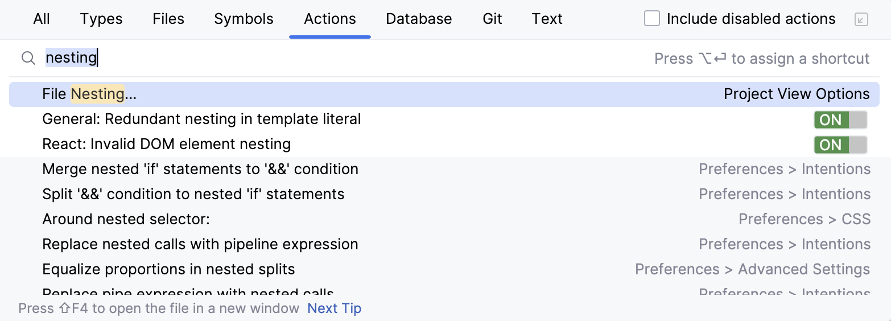
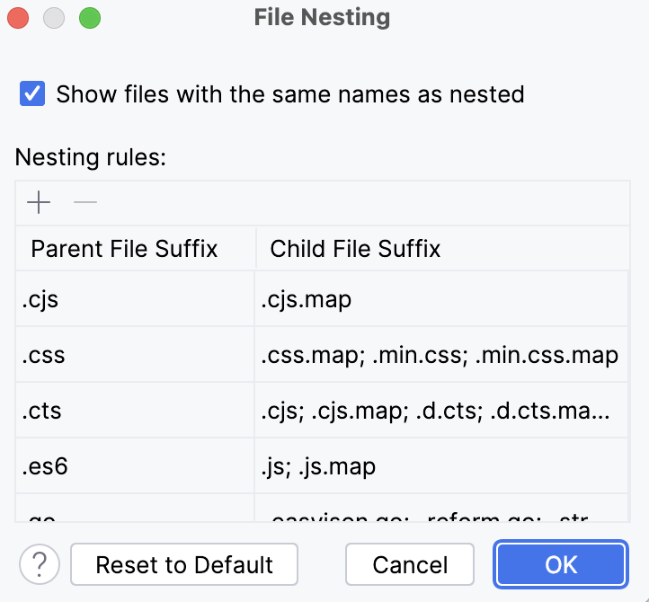
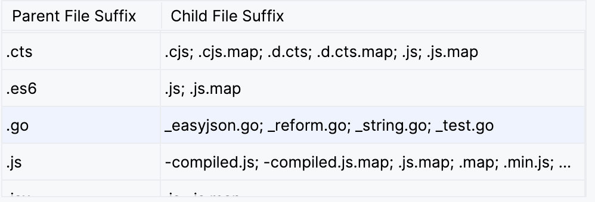
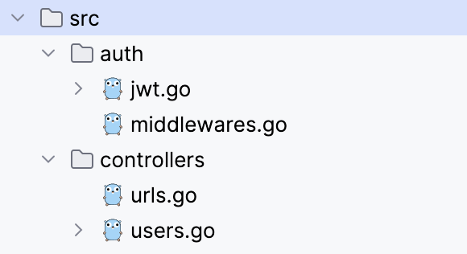
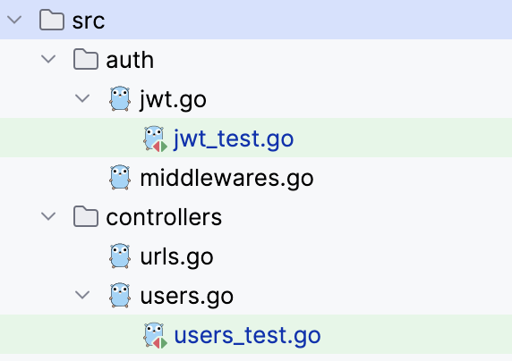
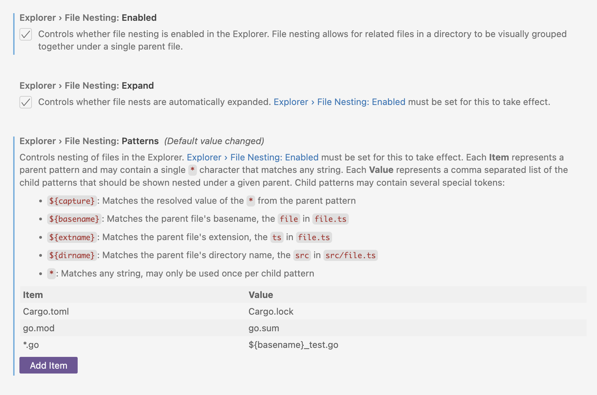
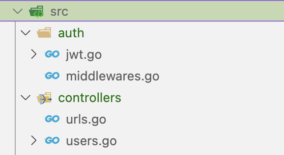
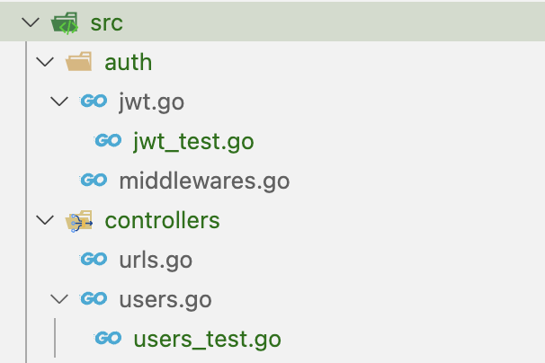

### Background

So let me start by saying that I come from the world of Java (originally an Android developer, before branching out to do all the other stuff). Which means there's a very rigid idea about how test files are structured back in my world.


Recently I started working on a Golang sample project <sup>1</sup> and I [was told](https://github.com/championswimmer/onepixel_backend/issues/22) that in Go, typically you keep test files beside your source files. Makes sense, Go's understanding of modules is different from Java's understanding of packages. In Java, when building the `test` package, the code from main and test are merged semantically keeping the test and the source *beside* each other in runtime.

Fair enough. Some Javascript projects do the same too - and I am ok doing this.

### My Problem with Project Structure

What I do not like though is this type of project structure (file explorer view) by default

```plaintext
- resources
- docs
- src 
    - users 
        - user_controller.go
        - user_controller_test.go
    - articles
        - article_data.go
        - article_data_tests.go
        - article_handler.go
        - article_handler_tests.go
```

What I would ***much rather*** prefer is - at first glance just see all my code.

```plaintext
- resources
- docs
- src 
    - users 
        - user_controller.go
    - articles
        - article_data.go
        - article_handler.go
```

and then, if I ***want to*** look at tests as well, I can expand them and see that as well

### Collapsing Test Files

I'll keep it short - you can do this on Jetbrains (Intellij IDEA, Goland etc) as well as Visual Studio Code. I am sure other IDEs have it too - I don't use them - so not my concern for now.

#### Jetbrains

On JetBrains IDEs the concerned feature we are looking for is called `File Nesting`

Search for that in the actions bar,



You'll get into this little modal



There is a simple pattern to map there.

If you want all files of type `xyz_test.go` to be nested under `xyz.go` then just add this



As you can see, some other patterns, like `_string.go` and `_easyjson.go` are already there. These are common Go libraries for JSON parsing and String i18n/l10n which generate such files. I added the `_test.go` into it.

Now, this is how my src folder looks like by default when I open it



And the tests can be expanded if I want to see them



#### Visual Studio Code

The same thing can be done for Visual Studio Code. The feature over there is also called `File Nesting` - we need to go to Settings and enable it first (it is disabled by default).



The file pattern is slightly different here. I have added 2 rules there - one for nesting `go.sum` file under the `go.mod` file (I like that Jetbrains Goland does this out of the box). For the other case I write

`*.go : ${basename}_test.go`

The description in VS Code for that setting (in my above screenshot as well) should be self-explanatory.

And voila, the same thing works on VS Code for now.





#### References

* \[1\] [https://github.com/championswimmer/onepixel\_backend](https://github.com/championswimmer/onepixel_backend)