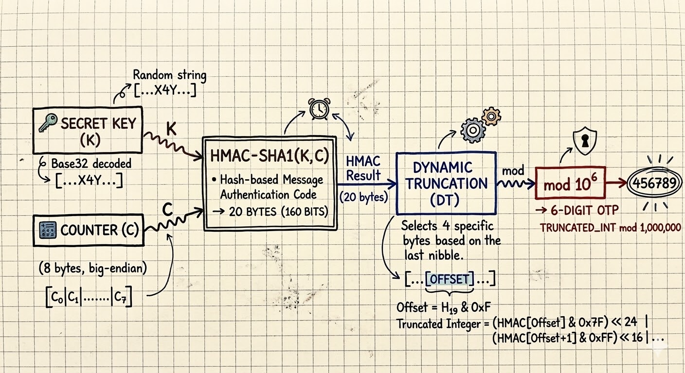
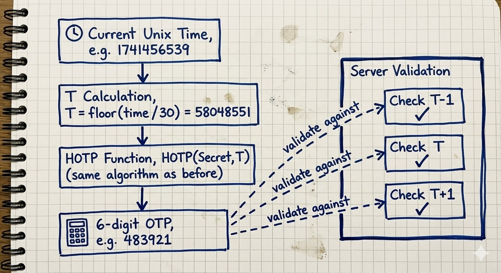
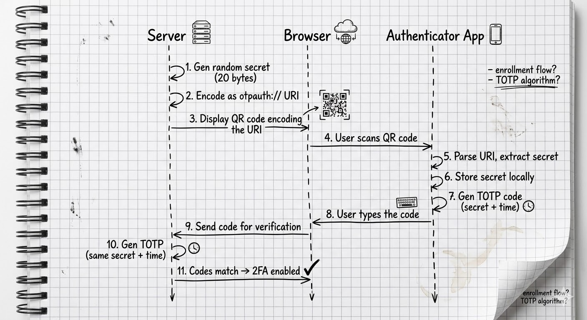
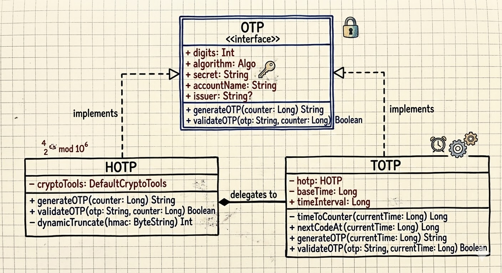
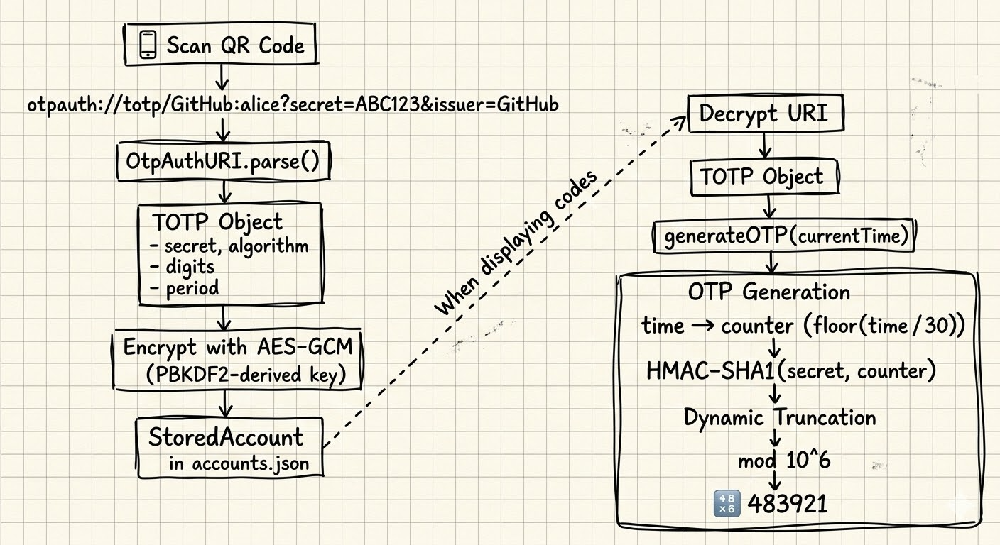

# Under the Hood: How 2FA TOTP Authenticator Apps Work

In the [previous article](https://arnav.tech/architecting-twofac-my-journey-into-kotlin-multiplatform-module-structure), I walked through how TwoFac is structured as a Kotlin Multiplatform project. Now that the architecture is in place, it's time to zoom into one of the most important pieces inside that shared core: the actual OTP generation. Ever wondered what actually happens when you open your authenticator app and see a 6-digit code counting down? Most of us just copy-paste it and move on, but there's some pretty elegant cryptography happening behind the scenes. In this post, I'm going to crack open the hood on **TOTP** — Time-based One-Time Passwords — explain the math, walk through the RFCs, and then show you exactly how we implement it in TwoFac.

> **Note:** This post focuses only on OTP generation — how we take a shared secret and turn it into those familiar 6-digit codes. How we *store* secrets securely (PBKDF2, AES-GCM, the `accounts.json` file) is a story for the next post.

## **Why Do We Even Need a "Second Factor"?**

Passwords alone are fundamentally brittle. They get reused, phished, leaked in data breaches, and brute-forced. The core idea behind two-factor authentication (2FA) is to combine **something you know** (your password) with **something you have** (your phone/authenticator app).

Even if an attacker steals your password, they'd also need physical access to your device to get the current OTP. And because the OTP changes every 30 seconds, a stolen code becomes useless almost immediately.

The beauty of TOTP-based 2FA is that it works **offline** — your authenticator app doesn't need to call any server. Both your app and the server independently compute the same code from a shared secret and the current time. No SMS, no push notification, no network dependency. Just math.

## **Starting from the Foundation: HOTP**

Before we can understand TOTP, we need to understand **HOTP** — HMAC-based One-Time Password, defined in [RFC 4226](https://datatracker.ietf.org/doc/html/rfc4226).

HOTP is conceptually simple: you have a **shared secret** and a **counter**. You feed both into an HMAC function, then extract a human-friendly number from the result.

### **The HOTP Algorithm Step-by-Step**

Here's the formula:

```plaintext
HOTP(K, C) = Truncate(HMAC-SHA1(K, C)) mod 10^d
```

Where:

*   **K** = the shared secret key (a byte array)
    
*   **C** = an 8-byte counter value (big-endian)
    
*   **d** = the number of digits in the output (usually 6)
    

Let's break each step down.

#### **Step 1: Counter to Bytes**

The counter is a 64-bit integer. We convert it to an 8-byte array in big-endian order. So counter `5` becomes:

```plaintext
[0x00, 0x00, 0x00, 0x00, 0x00, 0x00, 0x00, 0x05]
```

#### **Step 2: HMAC-SHA1**

We compute [HMAC](https://datatracker.ietf.org/doc/html/rfc2104) using the shared secret as the key and the counter bytes as the message. HMAC-SHA1 produces a **20-byte** (160-bit) hash.

HMAC itself is defined as:

```plaintext
HMAC(K, text) = H((K' ⊕ opad) || H((K' ⊕ ipad) || text))
```

Where `ipad` = `0x36` repeated, `opad` = `0x5c` repeated, and `K'` is the key padded to the hash's block size (64 bytes for SHA-1). Don't worry if this looks intimidating — in practice, every crypto library handles this for you.

#### **Step 3: Dynamic Truncation**

Here's where it gets clever. We have a 20-byte HMAC result, but we need a 6-digit number. RFC 4226 defines a **dynamic truncation** algorithm:

1.  Take the **last byte** of the HMAC and look at its lowest 4 bits. This gives you an **offset** (0–15).
    
2.  Starting at that offset, extract **4 consecutive bytes**.
    
3.  Mask off the most significant bit (to avoid sign issues), giving you a **31-bit unsigned integer**.
    

```plaintext
offset = hmac[19] & 0x0F

code = ((hmac[offset]     & 0x7F) << 24)
     | ((hmac[offset + 1] & 0xFF) << 16)
     | ((hmac[offset + 2] & 0xFF) << 8)
     |  (hmac[offset + 3] & 0xFF)
```

#### **Step 4: Modulo**

Finally, take that 31-bit integer modulo `10^digits` and pad with leading zeros:

```plaintext
otp = code % 1000000  →  "038314"
```

### **Visualizing the HOTP Flow**



### **HOTP's Limitation: The Counter Sync Problem**

With HOTP, both the client and server maintain a synchronized counter. Every time you generate a code, the counter increments. But what if you generate a code and *don't* use it? Your counter advances, but the server's doesn't. Now they're out of sync.

Servers deal with this by checking a "look-ahead window" — they'll try counter values `C`, `C+1`, `C+2`, ... up to some limit. But it's fragile. And a stolen HOTP code remains valid indefinitely until it's used or the counter advances past it.

This is exactly the problem TOTP solves.

## **Enter TOTP: Time as the Counter**

**TOTP** ([RFC 6238](https://datatracker.ietf.org/doc/html/rfc6238)) is HOTP, but with one elegant twist: instead of maintaining a counter, we **derive the counter from the current time**.

```plaintext
T = floor((CurrentUnixTime - T0) / TimeStep)
```

Where:

*   **CurrentUnixTime** = seconds since the Unix epoch (1970-01-01 00:00:00 UTC)
    
*   **T0** = the reference time (usually 0, i.e., the epoch itself)
    
*   **TimeStep** = how often the code changes (usually **30 seconds**)
    

Then we simply call HOTP with `T` as the counter:

```plaintext
TOTP(K, T) = HOTP(K, T)
```

That's it. The entire TOTP algorithm is just "replace the counter with a time-derived value."

### **Why 30 Seconds?**

The 30-second window is a balance between security and usability. Shorter windows (like 10 seconds) would be more secure but give users barely enough time to read and type the code. Longer windows (like 60 seconds) give attackers more time to use a stolen code. 30 seconds is the sweet spot recommended by [RFC 6238](https://datatracker.ietf.org/doc/html/rfc6238).

### **Clock Drift Tolerance**

What if the user's phone clock is slightly off? Servers typically accept OTPs from the **previous**, **current**, and **next** time windows — effectively creating a 90-second acceptance window. This is enough to handle minor clock drift without meaningfully reducing security.



### **TOTP Supports More Hash Algorithms**

While HOTP (RFC 4226) was specified with SHA-1 only, TOTP (RFC 6238) explicitly supports:

| Algorithm | HMAC Output | RFC 6238 Test Vectors |
| --- | --- | --- |
| HMAC-SHA1 | 20 bytes | ✅ Yes |
| HMAC-SHA256 | 32 bytes | ✅ Yes |
| HMAC-SHA512 | 64 bytes | ✅ Yes |

The dynamic truncation algorithm works the same regardless of hash output size — it always uses the last byte to find the offset, then extracts 4 bytes. The only difference is the range of possible offsets (0–15 for SHA-1 with 20 bytes, 0–15 for SHA-256 with 32 bytes, 0–15 for SHA-512 with 64 bytes — the offset is always 4 bits, so always 0–15).

In practice, the overwhelming majority of services use SHA-1. But some security-conscious services (like some crypto exchanges) use SHA-256 or SHA-512 for a larger HMAC output.

## **How TOTP Provisioning Works: QR Codes and** `otpauth://` **URIs**

When you enable 2FA on a website, this is what happens under the hood:



### **Anatomy of an** `otpauth://` **URI**

The QR code encodes a URI in the `otpauth://` [format](https://github.com/google/google-authenticator/wiki/Key-Uri-Format), formalized in the IETF draft [draft-linuxgemini-otpauth-uri](https://datatracker.ietf.org/doc/draft-linuxgemini-otpauth-uri/):

```plaintext
otpauth://totp/GitHub:alice@example.com?secret=JBSWY3DPEHPK3PXP&issuer=GitHub&algorithm=SHA1&digits=6&period=30
```

Let's break it down:

| Component | Example | Description |
| --- | --- | --- |
| **Scheme** | `otpauth://` | The URI scheme — tells the app this is an OTP credential |
| **Type** | `totp` | Either `totp` or `hotp` |
| **Label** | `GitHub:alice@example.com` | The issuer and account, separated by `:` |
| **secret** | `JBSWY3DPEHPK3PXP` | The shared secret, [Base32](https://datatracker.ietf.org/doc/html/rfc4648)\-encoded (no padding) |
| **issuer** | `GitHub` | The service name (displayed in the app) |
| **algorithm** | `SHA1` | Hash algorithm: `SHA1`, `SHA256`, or `SHA512` (default: SHA1) |
| **digits** | `6` | Number of digits: 6 or 8 (default: 6) |
| **period** | `30` | TOTP time step in seconds (default: 30) |
| **counter** | *(HOTP only)* | Initial counter value for HOTP |

The `secret` parameter is the star of the show — it's the shared secret that both the server and your authenticator app use to independently generate matching codes. It's Base32-encoded because Base32 uses only uppercase letters and digits 2–7, making it easy to display and manually type if QR scanning fails.

## **How Do Other Authenticator Apps Store Secrets?**

I found it really interesting to research how different authenticator apps handle OTP secret storage and backup. There's a **huge** range — from "barely encrypted" to "enterprise-grade security":

### **Google Authenticator**

Google Authenticator originally stored secrets in a **plaintext SQLite database** on Android — no encryption at all. If your device was rooted, anyone could read all your 2FA secrets directly. Their cloud sync feature (added in 2023) [initially transferred secrets without end-to-end encryption](https://www.androidauthority.com/google-authenticator-e2e-encryption-3317498/), meaning Google's servers could theoretically read them. They've since [added E2EE to cloud sync](https://security.googleblog.com/2023/04/google-authenticator-now-supports.html), but the local storage on Android still relies on the OS-level sandboxing rather than application-level encryption.

### **Microsoft Authenticator**

Microsoft Authenticator takes security more seriously. On iOS, secrets are stored in the [Keychain](https://developer.apple.com/documentation/security/keychain-services), and on Android they use [encrypted shared preferences](https://developer.android.com/reference/androidx/security/crypto/EncryptedSharedPreferences). Cloud backups are encrypted — iCloud backups are protected by Keychain, and Android backups go to Microsoft's servers with account-based encryption.

### **Authy (Twilio)**

Authy was one of the first authenticator apps to offer cloud backup. They encrypt secrets using a user-provided "backups password" (processed via [PBKDF2](https://datatracker.ietf.org/doc/html/rfc2898) or similar KDF) before uploading. The downside? The app is proprietary and [was sunset in 2024](https://www.twilio.com/docs/authy), with users urged to migrate. Also, in 2024, Twilio [disclosed a breach](https://techcrunch.com/2024/07/03/twilio-says-hackers-identified-cell-phone-numbers-of-two-factor-app-authy-users/) where phone numbers associated with Authy accounts were leaked (though not the secrets themselves).

### **1Password & Bitwarden**

Both 1Password and Bitwarden store TOTP secrets as part of their broader encrypted vault. They use [AES-256-GCM](https://csrc.nist.gov/publications/detail/sp/800-38d/final) with keys derived from your master password via [PBKDF2](https://datatracker.ietf.org/doc/html/rfc2898) (Bitwarden) or [Argon2](https://www.rfc-editor.org/rfc/rfc9106.html) (1Password). The secrets are just another encrypted field in your vault item. Both have been [independently audited](https://bitwarden.com/help/is-bitwarden-audited/) and are open-source (Bitwarden fully, 1Password's crypto components partially).

### **2FAS**

[2FAS](https://2fas.com/) is fully open-source and stores secrets encrypted on the device. They use a user-provided password to derive an encryption key. Backups are encrypted files that you control — no mandatory cloud. Their [source code is available on GitHub](https://github.com/twofas), which is a huge plus for auditability.

### **Ente Auth**

[Ente Auth](https://ente.io/auth/) is another open-source contender. They use end-to-end encryption with [XChaCha20-Poly1305](https://doc.libsodium.org/secret-key_cryptography/aead/chacha20-poly1305/xchacha20-poly1305_construction) for their cloud sync, with keys derived from the user's password via Argon2. Their code is [fully open-source](https://github.com/ente-io/ente) and has been independently audited.

### **Summary Table**

| App | Encryption at Rest | Cloud Backup | Backup Encryption | Open Source |
| --- | --- | --- | --- | --- |
| Google Authenticator | OS sandbox only | Optional (Google) | E2EE (added later) | ❌ |
| Microsoft Authenticator | Keychain / EncryptedPrefs | iCloud/Microsoft | Account-based | ❌ |
| Authy | Encrypted | Yes (Twilio) | Password-based | ❌ |
| 1Password | AES-256-GCM | Yes (1Password) | Master password | Partial |
| Bitwarden | AES-256-GCM | Yes (Bitwarden) | Master password | ✅ |
| 2FAS | Encrypted | Optional (file) | Password-based | ✅ |
| Ente Auth | XChaCha20-Poly1305 | Yes (Ente) | E2EE (Argon2) | ✅ |
| **TwoFac** | AES-256-GCM | Optional (file) | Password-based (PBKDF2) | ✅ |

## **Diving Into Our Codebase**

Now that we understand the theory, let's look at how TwoFac implements all of this. All the OTP logic lives in our `sharedLib` module — the pure Kotlin Multiplatform library that powers every platform (Android, iOS, Desktop, Web, CLI, Wear OS).

### **The Crypto Layer:** `cryptography-kotlin`

We use [cryptography-kotlin](https://github.com/whyoleg/cryptography-kotlin) by [whyoleg](https://github.com/whyoleg) — specifically `dev.whyoleg.cryptography` v0.5.0 — for all our cryptographic primitives. The beauty of this library is that it wraps **platform-native** crypto providers:

| Platform | Crypto Provider |
| --- | --- |
| JVM (Android, Desktop, Wear OS) | JDK (`java.security` / `javax.crypto`) |
| Native (iOS, macOS, Linux CLI) | OpenSSL 3 |
| Web (Wasm) | [Web Crypto API](https://developer.mozilla.org/en-US/docs/Web/API/Web_Crypto_API) |

This means we're not shipping a custom crypto implementation — on each platform, we're delegating to the **battle-tested, OS-level crypto** that's already there. Here's how the dependencies are configured in `sharedLib/build.gradle.kts`:

```kotlin
// commonMain
implementation(libs.crypto.kt.core)       // Core API

// jvmMain
implementation(libs.crypto.kt.jdk)        // → java.security / javax.crypto

// nativeMain (iOS, macOS, Linux)
implementation(libs.crypto.kt.openssl)    // → OpenSSL 3

// wasmJsMain (Web, Browser Extension)
implementation(libs.crypto.kt.web)        // → Web Crypto API
```

### **The CryptoTools Interface**

All cryptographic operations are abstracted behind a `CryptoTools` interface:

```kotlin
interface CryptoTools {
    enum class Algo { SHA1, SHA256, SHA512 }

    suspend fun hmacSha(algorithm: Algo, key: ByteString, data: ByteString): ByteString
    suspend fun createSigningKey(passKey: String, salt: ByteString? = null): SigningKey
    suspend fun encrypt(key: ByteString, secret: ByteString): ByteString
    suspend fun decrypt(encryptedData: ByteString, key: ByteString): ByteString
}
```

Notice everything is a `suspend fun` — this isn't just a Kotlin convention. On some platforms (especially WebCrypto), cryptographic operations are **inherently asynchronous**. By making the interface suspend-based, we can use the native async crypto APIs without blocking.

The `DefaultCryptoTools` implementation wires everything to `cryptography-kotlin`:

```kotlin
class DefaultCryptoTools(val cryptoProvider: CryptographyProvider) : CryptoTools {

    val hmac = cryptoProvider.get(HMAC)

    override suspend fun hmacSha(
        algorithm: CryptoTools.Algo,
        key: ByteString,
        data: ByteString
    ): ByteString {
        val keyDecoder = when (algorithm) {
            CryptoTools.Algo.SHA1 -> hmac.keyDecoder(SHA1)
            CryptoTools.Algo.SHA256 -> hmac.keyDecoder(SHA256)
            CryptoTools.Algo.SHA512 -> hmac.keyDecoder(SHA512)
        }
        val hmacKey = keyDecoder.decodeFromByteString(HMAC.Key.Format.RAW, key)
        val signature = hmacKey.signatureGenerator().generateSignature(data.toByteArray())
        return ByteString(signature)
    }
}
```

### **The OTP Interface**

Both HOTP and TOTP implement a common `OTP` interface:

```kotlin
interface OTP {
    val digits: Int                      // 6 or 8
    val algorithm: CryptoTools.Algo      // SHA1, SHA256, SHA512
    val secret: String                   // Base32-encoded
    val accountName: String              // e.g. "alice@example.com"
    val issuer: String?                  // e.g. "GitHub"

    suspend fun generateOTP(counter: Long): String
    suspend fun validateOTP(otp: String, counter: Long): Boolean
}
```

### **Our HOTP Implementation**

The `HOTP` class is a direct implementation of RFC 4226:

```kotlin
class HOTP(
    override val digits: Int = 6,
    override val algorithm: CryptoTools.Algo = CryptoTools.Algo.SHA1,
    override val secret: String,
    override val accountName: String,
    override val issuer: String?,
) : OTP {

    private val cryptoTools = DefaultCryptoTools(CryptographyProvider.Default)

    override suspend fun generateOTP(counter: Long): String {
        // 1. Counter → 8 bytes (big-endian)
        val counterBytes = ByteArray(8) { i ->
            ((counter shr ((7 - i) * 8)) and 0xFF).toByte()
        }

        // 2. Decode the Base32 secret
        val secretBytes = Encoding.decodeBase32(secret)

        // 3. HMAC
        val hmac = cryptoTools.hmacSha(
            algorithm,
            ByteString(secretBytes),
            ByteString(counterBytes)
        )

        // 4. Dynamic Truncation
        val fourBytes = dynamicTruncate(hmac)

        // 5. Modulo → pad with zeros
        val otp = fourBytes % 10.0.pow(digits.toDouble()).toInt()
        return otp.toString().padStart(digits, '0')
    }
}
```

The dynamic truncation method follows the RFC exactly:

```kotlin
internal fun dynamicTruncate(hmac: ByteString): Int {
    // Last byte's lowest 4 bits = offset (0-15)
    val offset = (hmac.get(hmac.size - 1) and 0x0F).toInt()

    // Extract 4 bytes, mask the MSB for a 31-bit unsigned int
    return ((hmac.get(offset).toInt() and 0x7F) shl 24) or
           ((hmac.get(offset + 1).toInt() and 0xFF) shl 16) or
           ((hmac.get(offset + 2).toInt() and 0xFF) shl 8) or
            (hmac.get(offset + 3).toInt() and 0xFF)
}
```

One thing I want to highlight: our `dynamicTruncate` uses `hmac.size - 1` instead of hardcoding `19` (like you'd see in SHA-1-only implementations). This makes it work correctly with SHA-256 (32 bytes) and SHA-512 (64 bytes) too.

### **Our TOTP Implementation**

The `TOTP` class is remarkably simple because it just wraps HOTP:

```kotlin
class TOTP(
    override val digits: Int = 6,
    override val algorithm: CryptoTools.Algo = CryptoTools.Algo.SHA1,
    override val secret: String,
    override val accountName: String,
    override val issuer: String?,
    private val baseTime: Long = 0,    // Unix epoch
    val timeInterval: Long = 30        // 30 seconds
) : OTP {

    // Reuse HOTP internally!
    private val hotp = HOTP(digits, algorithm, secret, accountName, issuer)

    private fun timeToCounter(currentTime: Long): Long {
        return (currentTime - baseTime) / timeInterval
    }

    override suspend fun generateOTP(currentTime: Long): String {
        val counter = timeToCounter(currentTime)
        return hotp.generateOTP(counter)
    }

    override suspend fun validateOTP(otp: String, currentTime: Long): Boolean {
        val counter = timeToCounter(currentTime)
        // Check previous, current, and next windows (±1)
        return hotp.validateOTP(otp, counter - 1) ||
               hotp.validateOTP(otp, counter) ||
               hotp.validateOTP(otp, counter + 1)
    }
}
```

This is one of my favorite parts of the codebase. The `TOTP` class doesn't duplicate *any* crypto logic — it just converts time into a counter and delegates to `HOTP`. The `validateOTP` method checks ±1 time windows (the standard tolerance for clock drift).



### **Parsing** `otpauth://` **URIs**

When you scan a QR code, we need to parse the `otpauth://` URI and create the right OTP object. This is handled by `OtpAuthURI`:

```kotlin
object OtpAuthURI {
    fun parse(uri: String): OTP {
        require(uri.startsWith("otpauth://"))

        // Extract type: "totp" or "hotp"
        val typeStr = uri.substring(10, uri.indexOf("/", 10))

        // Extract label: "GitHub:alice@example.com"
        val label = uri.substring(uri.indexOf("/", 10) + 1, uri.indexOf("?"))
        val labelIssuer = label.substringBefore(":", "")
        val accountName = label.substringAfter(":", label).trim()

        // Parse query parameters
        val params = paramsStr.split("&").associate { /* ... */ }

        val secret = params["secret"]!!
        val algorithm = when (params["algorithm"]?.uppercase()) {
            "SHA256" -> CryptoTools.Algo.SHA256
            "SHA512" -> CryptoTools.Algo.SHA512
            else -> CryptoTools.Algo.SHA1  // Default
        }

        return when (type) {
            Type.TOTP -> TOTP(
                digits = params["digits"]?.toIntOrNull() ?: 6,
                algorithm = algorithm,
                secret = secret,
                timeInterval = params["period"]?.toLongOrNull() ?: 30L,
                accountName = accountName,
                issuer = issuer
            )
            Type.HOTP -> HOTP(/* ... */)
        }
    }
}
```

The parser also has a `Builder` that works in reverse — given an `OTP` object, it constructs the `otpauth://` URI. This is used when exporting or backing up accounts.

### **Base32 Encoding**

OTP secrets in the `otpauth://` URI are Base32-encoded per [RFC 4648](https://datatracker.ietf.org/doc/html/rfc4648). We implement our own Base32 encoder/decoder in `Encoding.kt`:

```kotlin
object Encoding {
    const val ALPHABET = "ABCDEFGHIJKLMNOPQRSTUVWXYZ234567"

    fun decodeBase32(base32: String): ByteArray {
        val cleanInput = base32.replace("=", "").uppercase()
        // Each Base32 character represents 5 bits
        // We accumulate bits in a buffer and emit bytes when we have 8+
        var buffer = 0
        var bitsLeft = 0
        /* ... */
    }
}
```

Why Base32 instead of Base64? Base32 uses only uppercase letters and digits 2–7, so there's no ambiguity between `0`/`O`, `1`/`l`/`I`, or `+`/`/`. This matters because users might need to manually type the secret if QR scanning fails.

### **How We Store OTP Accounts**

Each OTP account is stored as a `StoredAccount`:

```kotlin
@Serializable
data class StoredAccount(
    val accountID: Uuid,          // Unique identifier
    val accountLabel: String,     // Display name (e.g. "GitHub - alice")
    val salt: String,             // Salt for key derivation
    val encryptedURI: String,     // The otpauth:// URI, encrypted with AES-GCM
)
```

Notice that we store the **encrypted** `otpauth://` URI, not the raw secret. The entire URI (which contains the secret, algorithm, issuer, etc.) is encrypted with AES-256-GCM using a key derived from the user's password via PBKDF2. Each account gets its own salt.

This means even if someone gets access to the storage file, they can't read any OTP secrets without the user's password. But that's a topic for the next post — where we'll dive deep into PBKDF2, AES-GCM, and the `accounts.json` storage format.

## **Verifying Against the RFCs**

One thing I'm particularly proud of is that our test suite validates against the **official RFC test vectors**. Here's a snippet from our [HOTP tests](https://github.com/championswimmer/TwoFac/tree/main/sharedLib/src/commonTest/kotlin/tech/arnav/twofac/lib/otp/HOTPTest.kt):

```kotlin
// Secret: "12345678901234567890" (ASCII)
// Base32: "GEZDGNBVGY3TQOJQGEZDGNBVGY3TQOJQ"
val expectedOTPs = listOf(
    "755224", // Counter = 0
    "287082", // Counter = 1
    "359152", // Counter = 2
    "969429", // Counter = 3
    "338314", // Counter = 4
    "254676", // Counter = 5
    "287922", // Counter = 6
    "162583", // Counter = 7
    "399871", // Counter = 8
    "520489"  // Counter = 9
)
```

These are the exact test vectors from [RFC 4226 Appendix D](https://datatracker.ietf.org/doc/html/rfc4226#appendix-D). Our [TOTP tests](https://github.com/championswimmer/TwoFac/tree/main/sharedLib/src/commonTest/kotlin/tech/arnav/twofac/lib/otp/TOTPTest.kt) go even further, validating against [RFC 6238's test vectors](https://datatracker.ietf.org/doc/html/rfc6238#appendix-B) with all three hash algorithms:

```kotlin
// RFC 6238 test vectors with 8-digit codes
RFC6238TestVector(59, "1970-01-01 00:00:59", key_sha1, SHA1, "94287082"),
RFC6238TestVector(59, "1970-01-01 00:00:59", key_sha256, SHA256, "46119246"),
RFC6238TestVector(59, "1970-01-01 00:00:59", key_sha512, SHA512, "90693936"),
// ... and more timestamps across decades
```

If our implementation matches the RFC test vectors on every platform (JVM, Native, Wasm), we can be confident we're computing OTPs correctly.

## **The Full Picture**

Here's how everything fits together in TwoFac — from scanning a QR code to displaying the 6-digit code on your screen:



## **What's Next?**

In this post we covered the *generation* side of things — how a shared secret and the current time produce those familiar 6-digit codes. But generation is only half the story.

In the next post, we'll explore the *storage* side: how TwoFac protects your secrets at rest using **PBKDF2** for key derivation and **AES-256-GCM** for authenticated encryption. We'll walk through the `accounts.json` format, why we chose the iteration counts we did, and how the encryption pipeline works across all platforms.

* * *

### **Links and References**

*   [TwoFac GitHub Repository](https://github.com/championswimmer/TwoFac)
    
*   [RFC 4226 — HOTP: An HMAC-Based One-Time Password Algorithm](https://datatracker.ietf.org/doc/html/rfc4226)
    
*   [RFC 6238 — TOTP: Time-Based One-Time Password Algorithm](https://datatracker.ietf.org/doc/html/rfc6238)
    
*   [RFC 2104 — HMAC: Keyed-Hashing for Message Authentication](https://datatracker.ietf.org/doc/html/rfc2104)
    
*   [RFC 4648 — Base Encodings (Base32)](https://datatracker.ietf.org/doc/html/rfc4648)
    
*   [draft-linuxgemini-otpauth-uri — The otpauth URI Format](https://datatracker.ietf.org/doc/draft-linuxgemini-otpauth-uri/)
    
*   [Google Authenticator Key URI Format](https://github.com/google/google-authenticator/wiki/Key-Uri-Format)
    
*   [cryptography-kotlin by whyoleg](https://github.com/whyoleg/cryptography-kotlin)
    
*   [NIST SP 800-38D — AES-GCM](https://csrc.nist.gov/publications/detail/sp/800-38d/final)
