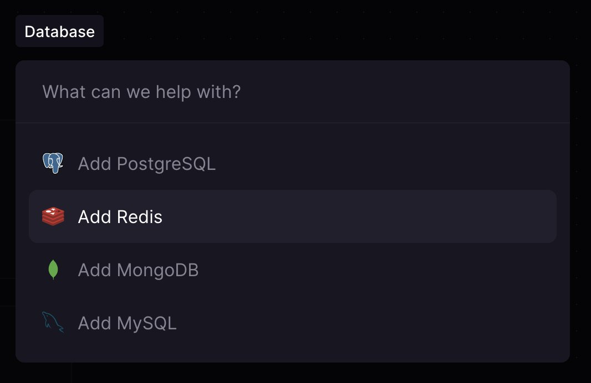
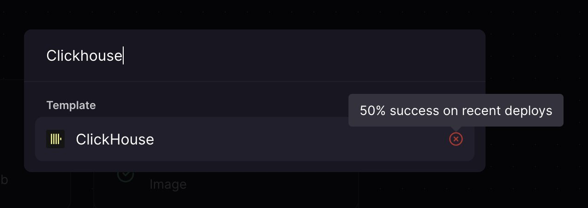
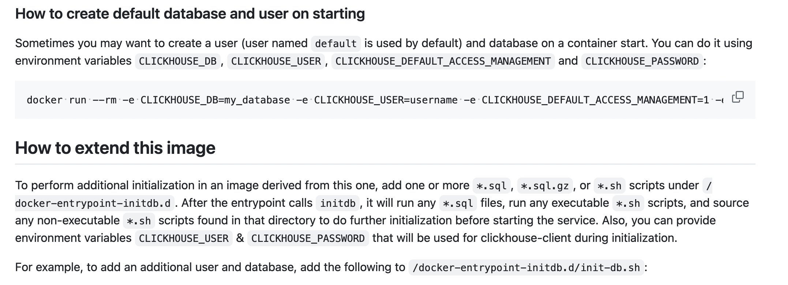
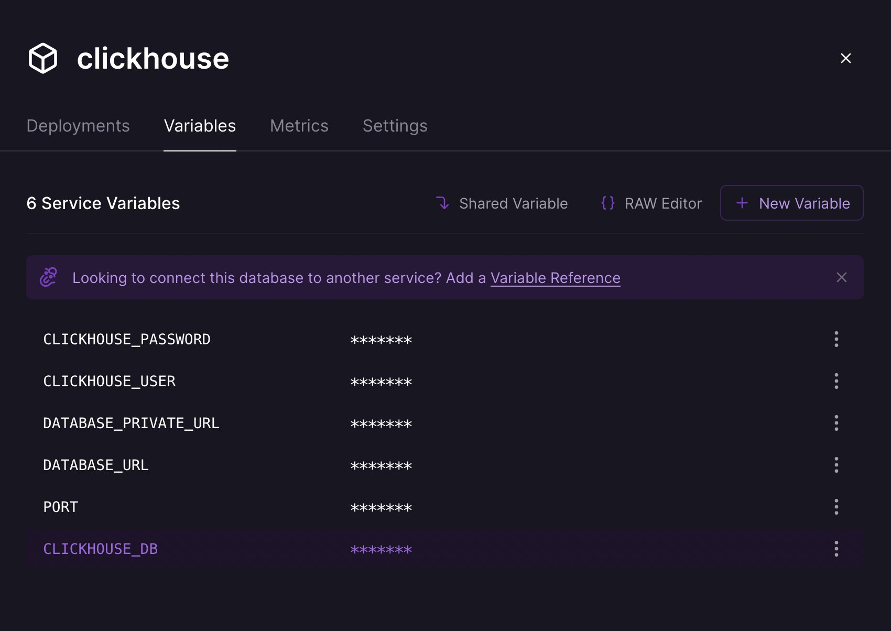
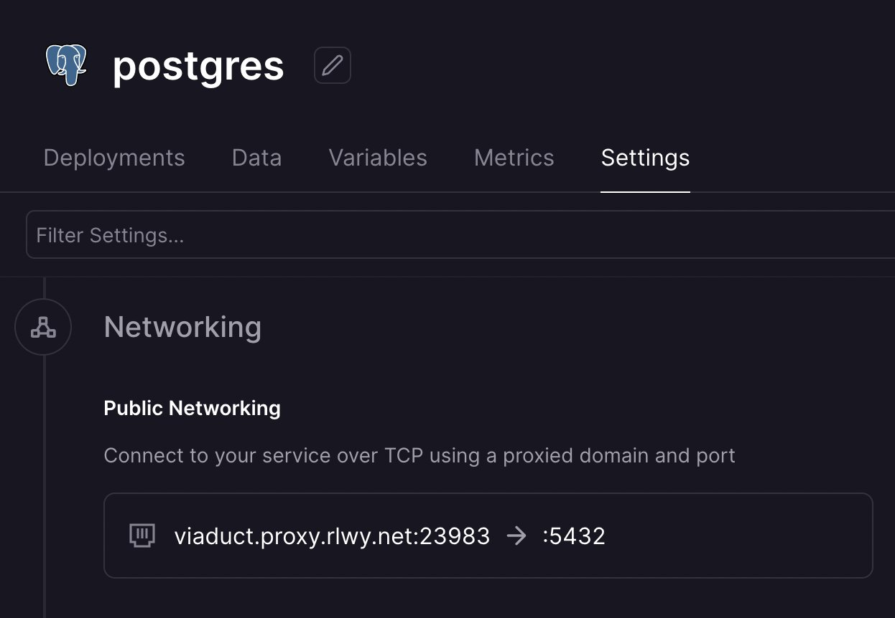
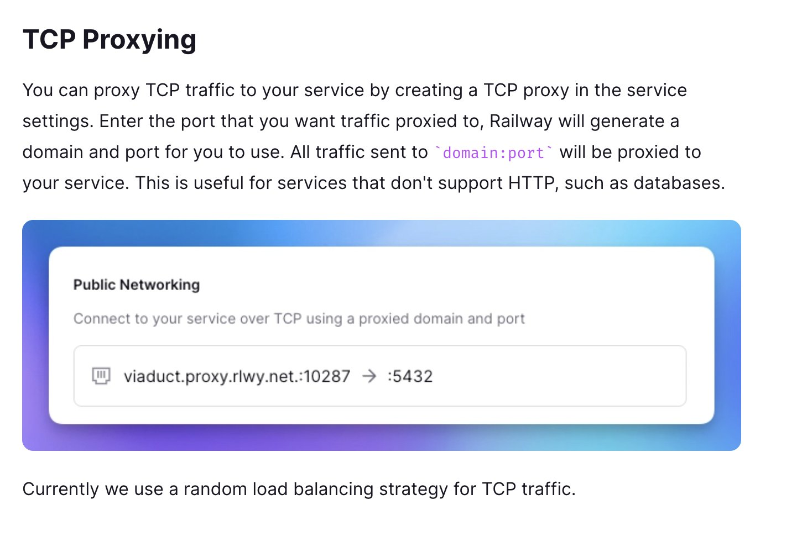
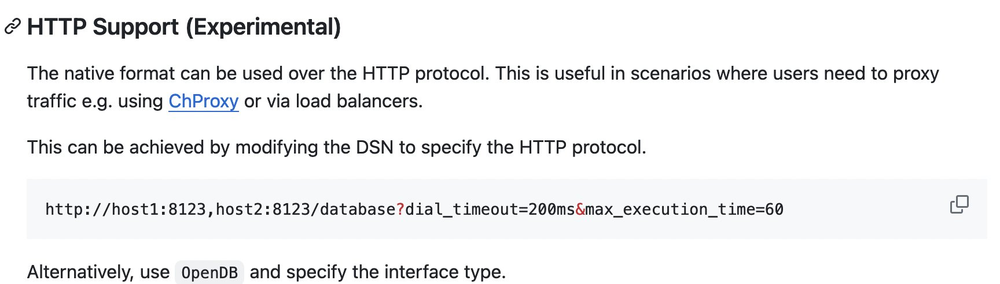
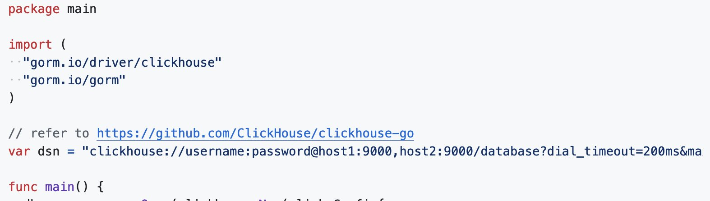
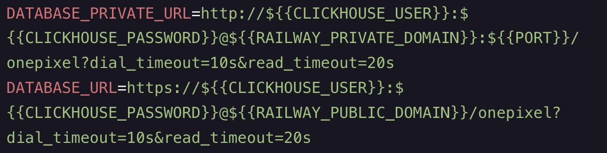

> NOTE: I encountered this while working on the 1px.li project. You can find the source code of that [here](https://github.com/championswimmer/onepixel_backend). It is hosted on Railway. You can find the hosting configuration and what all services it uses on [Railway here.](https://railway.app/project/d26a3016-de8c-4f9e-a873-aa810176f825)

For most things on [http://1px.li](https://t.co/MzBScT2FOM) so far I want to have a clean Dockerfile and docker-compose - and have a setup that replicates well on localhost as well as on Railway. So far Postgres was a charm. Clickhouse is not an officially supported "database" on Railway though.

But searching for Clickhouse does turn up a community-maintained image from marketplace, made by [Greg Scheir](https://twitter.com/GregorySchier), a Railway employee. It is basically straight up `clickhouse/clickhouse-server:23.3.8.21` docker image only, which is great for my "whatever works on localhost, works same on Railway" principle.

Since the docker image takes variables `CLICKHOUSE_USER`, `CLICKHOUSE_PASSWORD` and `CLICKHOUSE_DB` by default, it is really easy to configure those things when deploying to Railway - just set those variables.

The challenge really comes in connecting to this database from other Railway services. So what happens for a databases like Postgres is that Railway sets up a TCP proxy for you - so that you can connect with the database's native driver that talks over raw TCP. Some databases (including Clickhouse) do allow connecting over HTTP(S) as well - but typically that is inefficient and unnecessary if your servers are inside a VPC already. While the docs at [Railway.app](https://railway.app) do seem to say that TCP proxying is available for any service, at least when I launched the Clickhouse template I found there is no way to set up TCP proxy, but only use the HTTP connection.

Using Clickhouse over HTTP is something that'll take slight bit of digging to figure out all the pieces of the puzzle.

The official drivers seems to be made only for native connections, but actually it does support HTTP mode as well. It is said to be "***experimental***" though - I believe some types of data might fail while escaping it to be able to pass through HTTP bodies. (I haven't faced any problem so far)

**But**, I was not interested in using the raw driver. I am already using Gorm, and wanted to use Gorm for Clickhouse as well. But the gorm driver doesn't quite clearly mention that you *can* connect over HTTP too just by passing `http://` as the schema instead of `clickhouse://`

The gorm clickhouse driver has moved to v2 of the [clickhouse golang library](https://github.com/ClickHouse/clickhouse-go), and thus, it can automatically use HTTP mode when the URL is HTTP protocol. Had to take to look through the source code to figure out that they handle it, before I could use it. Now to actually connect to this service on Railway, the best is to formulate 2 URLs, one for private and one for public access.

**Private Access:**

* you can use http, not https (within your cloud)
    
* server is exposed on the port of that service (default: 8123)
    

**Public Access**

* use https (Railway will handle TLS for you)
    
* server is exposed on 443, not the internal port, so don't specify port in this URL
    

The public URL is what you can connect to from your laptop. The private URL is what you should use from your server hosted inside Railway to access this.